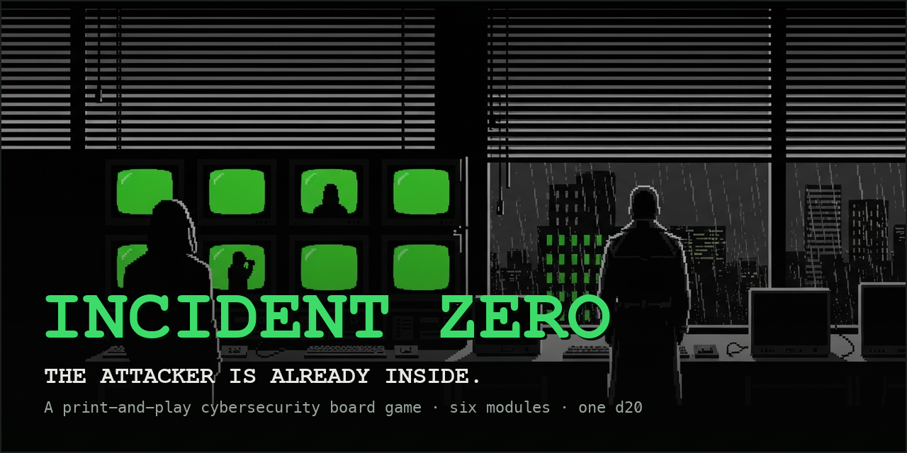

# Incident Zero

> A modular cybersecurity board game for educational environments

## Play. Learn. Master Cybersecurity.

**Incident Zero** is a hands-on tabletop game that teaches cybersecurity concepts through strategic gameplay. Choose from 6 modular games or combine them for endless learning possibilities.

### 🎮 6 Modules. Infinite Combinations.

- **Network Building** - Design and secure network infrastructure
- **Hardening** - Build layered defenses against known threats
- **Incident Response** - Detect and investigate hidden attack chains
- **Disaster Recovery** - Manage a breach crisis under pressure
- **Forensics** - Investigate compromised systems and attribute attacks
- **Audit & Compliance** - Conduct security assessments

### ✨ For Educators & Security Teams

Perfect for classrooms, security training, team building, and professional development.

### 📚 [Explore Documentation](/)

[Quick Start Guide](#quick-start) • [View Cards](#card-decks) • [GitHub](https://github.com/retroverse-studios/incident-zero) • [License: CC BY-NC-SA 4.0](LICENSE)

---

## Quick Start

### 1. Choose Your Game
Pick from 6 standalone modules or combine multiple games for deeper learning.

### 2. Gather Materials
Print card decks, game boards, and player aids from our documentation.

### 3. Play & Learn
Follow module rules for 30-45 minute games or combine for longer experiences.

### 📖 [View Full Documentation](README.md)

